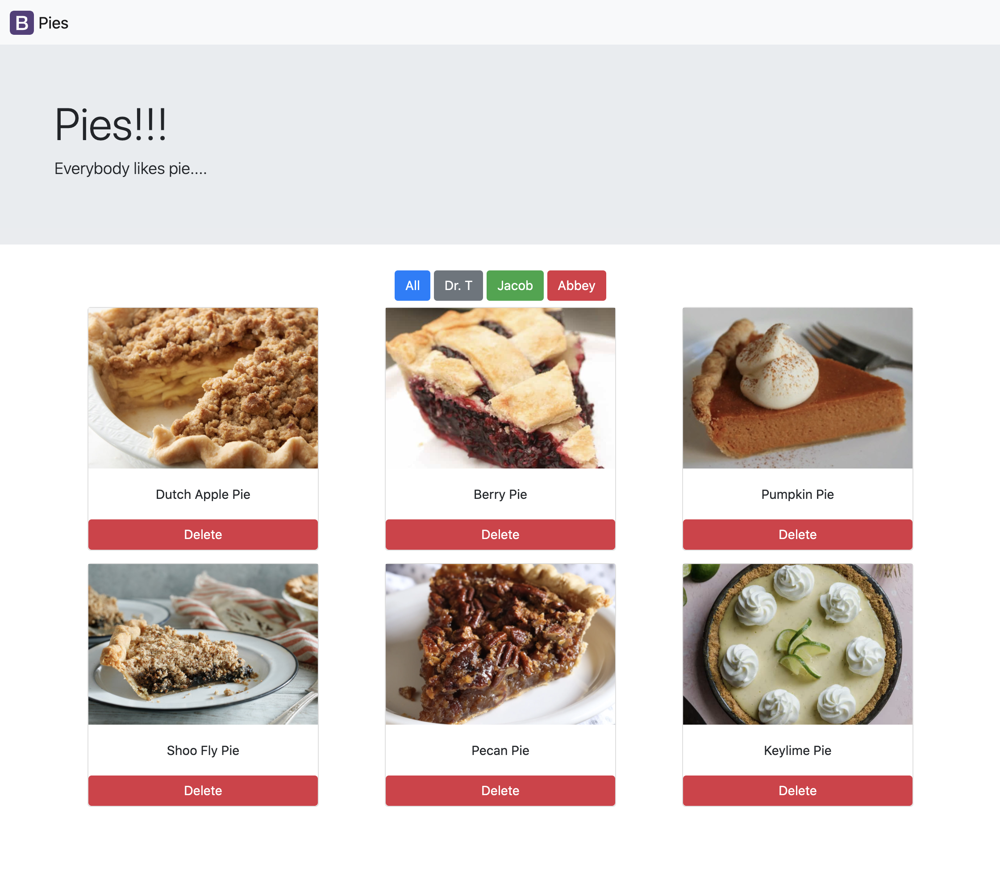

# PIES!



### Object 

```javascript
const pies = [
  {
    name: "Dutch Apple Pie",
    ingredients: "apples,sugar,butter,nutmeg,dutch people",
    bakeTemp: 5000,
    drinkPairing: "Earl Grey Tea",
    imageUrl:
      "https://images-gmi-pmc.edge-generalmills.com/b6a2a4e7-73f5-4aec-9bb6-f2b5054d65e6.jpg",
    instructor: "Doc",
    iceCream: "Vanilla",
  },
  {
    name: "Berry Pie",
    ingredients: "berries",
    bakeTemp: 400,
    drinkPairing: "wine",
    imageUrl:
      "https://tastesbetterfromscratch.com/wp-content/uploads/2015/11/Triple_Berry_Pie8.jpg",
    instructor: "Doc",
    iceCream: "banana",
  },
  {
    name: "Pumpkin Pie",
    ingredients: "pumpkins, nutmeg, cinnamon, graham crackers, pilgrims",
    bakeTemp: 42,
    drinkPairing: "egg nog",
    imageUrl:
      "https://cf-images.us-east-1.prod.boltdns.net/v1/static/1033249144001/22a0c25d-2fee-415c-a4e7-91d008e276bb/a904f3e2-3cd9-40d6-ace9-f8dbd2d616cd/1280x720/match/image.jpg",
    instructor: "Jacob",
    iceCream: "Vanilla",
  },
  {
    name: "Shoo Fly Pie",
    ingredients: "Molasses, nutmeg, cinnamon, butter, graham cracker ",
    bakeTemp: 1234,
    drinkPairing: "Apple Cider",
    imageUrl:
      "https://static01.nyt.com/images/2016/09/27/dining/27COOKING-SHOOFLY-PIE2/27COOKING-SHOOFLY-PIE2-articleLarge.jpg",
    instructor: "Jacob",
    iceCream: "Coffee",
  },
  {
    name: "Pecan Pie",
    ingredients: "Pecans, sugar, butter, flour",
    bakeTemp: 5000,
    drinkPairing: "Milk",
    imageUrl:
      "https://cookiesandcups.com/wp-content/uploads/2018/10/pecanpie-3.jpg",
    instructor: "Abbey",
    iceCream: "Vanilla",
  },
  {
    name: "Keylime Pie",
    ingredients: "lemons, sugar, butter, flour",
    bakeTemp: 5000,
    drinkPairing: "Water",
    imageUrl:
      "https://www.browneyedbaker.com/wp-content/uploads/2012/05/key-lime-pie-2-1200.jpg",
    instructor: "Abbey",
    iceCream: "none",
  }
];
```